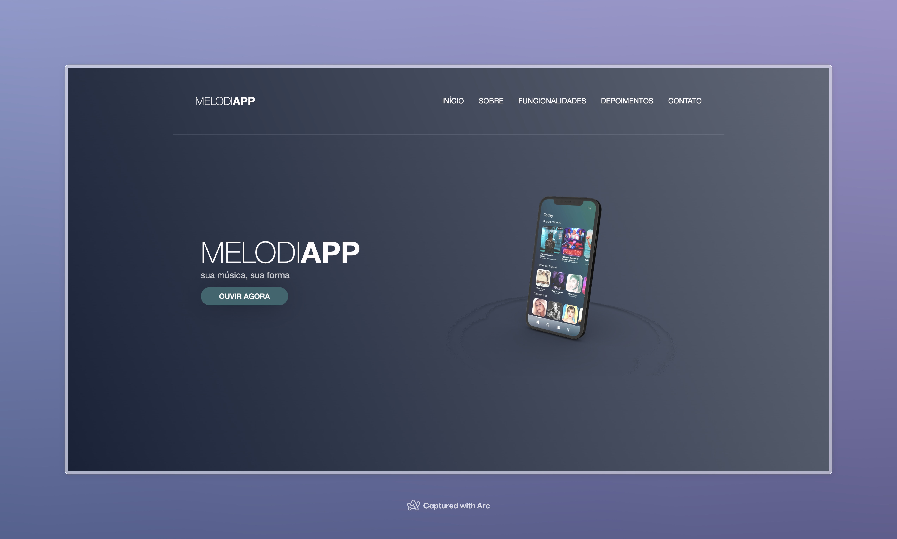

# Projeto

Criar uma landing page para um aplicativo de música chamado Melodia. O app tem que ser atrativo para os jovens, mas também atrair os outros públicos.

# Tecnologias

- SCSS
- HTML5

# Ferramentas de desenvolvimento
- concurrently
- lite-server
- node-sass

# Motivação

Se trata do checkpoint/avaliação para a matéria de Front-end Design, ministrada pelo professor Lucas Silva.

# Membros

- Caio Venancio (RM 556030)
- David Cordeiro (RM 557538)
- Marcos Ferreira (RM 556228)
- Tiago Morais (RM 555619)